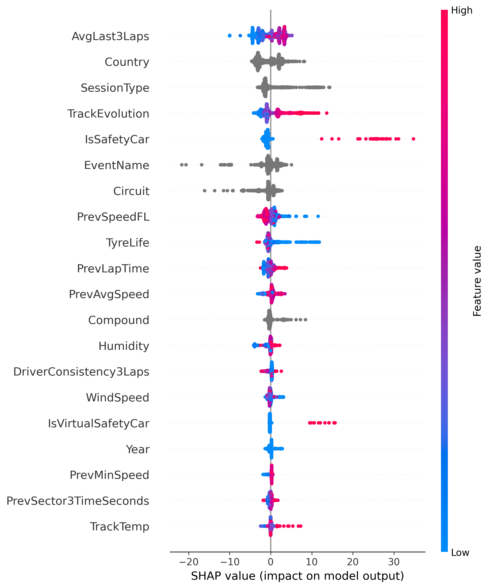
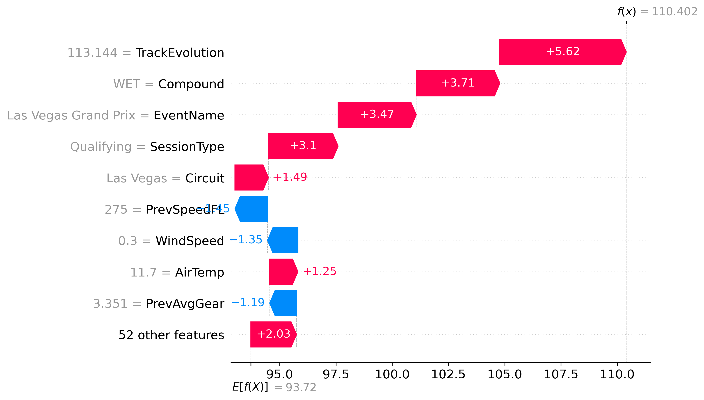

# Explainability Report

This report provides Explainable AI (XAI) insights into our primary predictive model using SHAP (SHapley Additive exPlanations).

## Global Feature Importance

The summary plot below shows the most important features driving the model's predictions across the validation set. 
- **Features at the top** have the highest impact on the output.
- **Color** represents the feature value (red is high, blue is low).
- **Horizontal location** shows whether that value pushed the prediction higher or lower.

## Local Prediction Explanation

The waterfall plot below breaks down exactly how the model arrived at its prediction for a single specific validation case.
- The **bottom value** is the expected (base) prediction across the dataset.
- Each **bar** shows how a specific feature value pushed the prediction up (red) or down (blue).
- The **top value** is the final predicted output.

> [!NOTE]
> These explanations are generated using `shap.TreeExplainer` on the primary CatBoost model to ensure accurate attribution of both numerical and native categorical features.
